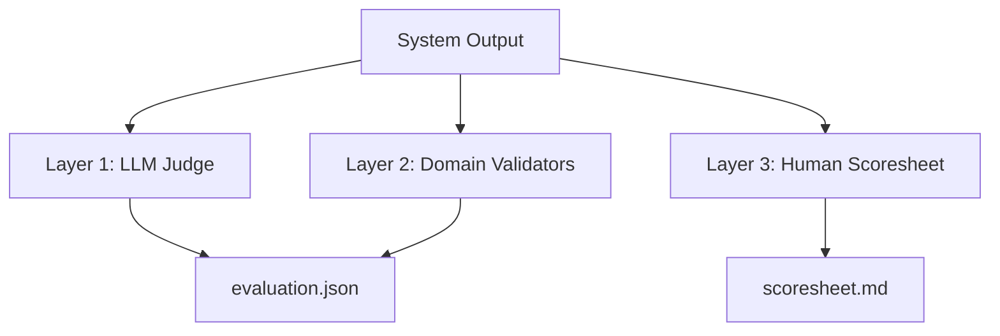

# Evaluation Overview

Outputs are assessed through three independent layers, providing both automated and human-verifiable quality signals.

## Layer Summary

| Layer | Method | Output | Cost |
|-------|--------|--------|------|
| [LLM Judge](judge.md) | GPT scores against rubrics | Scores 1-5 + justifications | ~1 LLM call per artifact |
| [Domain Validators](validators.md) | Deterministic physics checks | Pass/fail per check | Free (no LLM) |
| [Human Scoresheet](scoresheet.md) | Expert fills structured rubric | Comments + scores | Manual |

## When Each Runs

- **LLM Judge** — runs automatically after each system completes (disable with `--no-judge`)
- **Domain Validators** — runs automatically (disable with `--no-validators`)
- **Human Scoresheet** — generated on demand via Python API

## Aggregate Metrics

The comparison table shows two evaluation columns:

| Metric | Source | Range |
|--------|--------|-------|
| **Judge Score** | Mean of LLM judge overall scores | 1.0 – 5.0 |
| **Verified** | Fraction of validator checks that pass | 0.0 – 1.0 |
