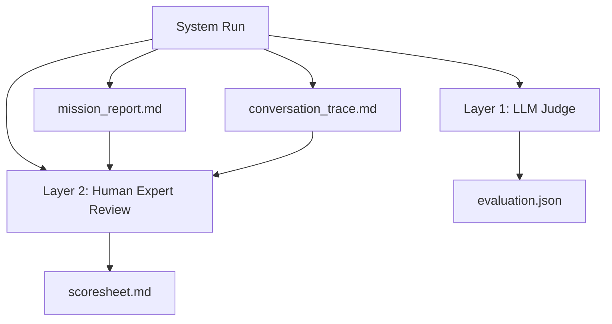

# Evaluation Overview

Outputs are assessed through two independent layers, providing both automated and human-verifiable quality signals. Each run produces two primary artifacts for review:

1. **Mission Report** (`mission_report.md`) — the technical design output, evaluated for design accuracy, constraint adherence, and completeness.
2. **Conversation Trace** (`conversation_trace.md`) — the full chain-of-thought transcript showing agent interactions, task delegation, and decision-making, evaluated for orchestration quality.

## Layer Summary

| Layer | Method | Input | Output | Cost |
|-------|--------|-------|--------|------|
| [LLM Judge](judge.md) | GPT scores against rubrics | Mission report artifacts | Scores 1-5 + justifications | ~1 LLM call per artifact |
| [Human Expert](scoresheet.md) | Expert reviews both report and trace | Mission report + conversation trace | Comments + scores | Manual |

## Expert Review Protocol

For each experimental condition (e.g., 4 runs x 3 systems = 12 runs), experts receive:

- **12 mission reports** — for technical evaluation (design accuracy, constraint adherence, hallucination rate, reproducibility)
- **12 conversation traces** — for orchestration evaluation (task delegation efficiency, iteration quality, expert response integration, decision-making structure)

The conversation trace is formatted differently per system type:

- **Single Agent**: prompt and response (baseline, minimal orchestration to evaluate)
- **Centralized Manager**: round-by-round manager reasoning, delegation decisions, and specialist responses
- **DiCWO**: iteration-level view with bidding, consensus votes, team/topology/protocol selection, checkpoint signals, policy decisions, and agent spawns

## When Each Runs

- **LLM Judge** — runs automatically after each system completes (disable with `--no-judge`)
- **Human Scoresheet** — generated on demand via Python API
- **Conversation Trace** — saved automatically with every run

## Aggregate Metrics

The comparison table shows the evaluation column:

| Metric | Source | Range |
|--------|--------|-------|
| **Judge Score** | Mean of LLM judge overall scores | 1.0 – 5.0 |
