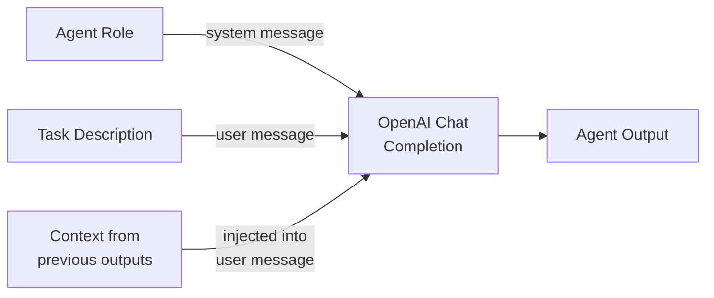

# Prompt Architecture

How agent roles, task descriptions, and system prompts flow into the LLM calls — with no framework involved.

## The Three Building Blocks

The framework uses three types of text to control what each LLM call produces:



| Building block | Defined in | Becomes | Purpose |
|---------------|-----------|---------|---------|
| **Agent Role** | `src/domain/roles.py` | `system` message (first message in conversation) | Sets the LLM's persona, expertise, and focus area |
| **Task Description** | `src/domain/prompts.py` → `TASK_DESCRIPTIONS` | `user` message content | Tells the agent what specific work to produce |
| **System Prompts** | `src/domain/prompts.py` → various constants | `system` or `user` messages depending on system type | Controls orchestration behaviour (routing, integration, etc.) |

## How Roles Become System Prompts

Each agent role (`AgentIdentity`) is a dataclass with four fields:

```python
@dataclass
class AgentIdentity:
    name: str       # "Payload Expert"
    role: str       # "RF Payload and Antenna Engineer"
    goal: str       # "Determine antenna diameter and directivity..."
    backstory: str  # "An RF payload engineer specializing in..."
```

When a `BaseAgent` is created, `__post_init__` calls `identity.system_prompt()` and places the result as the first message in the conversation history:

```python
# What the LLM actually sees as its system message:
"You are Payload Expert, a RF Payload and Antenna Engineer.

Goal: Determine antenna diameter and directivity for 3 different altitudes...

Background: An RF payload engineer specializing in link budgets and antenna
design, focusing on large-aperture deployable antennas for LEO-to-ground
communications..."
```

This is standard OpenAI chat completion — the `system` message steers the LLM's behaviour for every subsequent turn.

## How Each System Uses These

### Single Agent

Uses **none** of the roles or task descriptions. Instead, it sends two dedicated prompts in a single LLM call:

| Message | Source | Content |
|---------|--------|---------|
| `system` | `SINGLE_AGENT_SYSTEM_PROMPT` | "You are a senior satellite systems engineer... cover ALL of the following areas..." |
| `user` | `SINGLE_AGENT_USER_PROMPT` | "Design a LEO satellite constellation for global DTHH..." |

One call, one response, no agents. The system prompt embeds all five disciplines inline.

### Centralized Manager

The manager agent has its own system prompt (`MANAGER_SYSTEM_PROMPT`) that instructs it to route tasks to specialists. Each specialist is a `BaseAgent` with its role as the system message:

```
┌─────────────────────────────────────────────┐
│ Manager (system: MANAGER_SYSTEM_PROMPT)     │
│   → decides: "next_agent: Payload Expert"   │
│   → sends task description as user message  │
└──────────────────┬──────────────────────────┘
                   │
    ┌──────────────▼──────────────────────┐
    │ Payload Expert                      │
    │   system: role.system_prompt()      │
    │   user: TASK_DESCRIPTIONS["payload_ │
    │         design"] + context from     │
    │         previous specialists        │
    └─────────────────────────────────────┘
```

Key prompts:

| Prompt | Used by | When |
|--------|---------|------|
| `MANAGER_SYSTEM_PROMPT` | Manager agent | Every routing decision |
| `MANAGER_ROUTING_PROMPT` | Manager agent | Formatted with current state, completed tasks, remaining budget |
| `CONTEXT_INJECTION` | Specialist agents | Prepended to task with outputs from other specialists |
| `INTEGRATION_PROMPT` | Manager agent | Final pass to check cross-subsystem consistency |
| `TASK_DESCRIPTIONS[*]` | Specialist agents | The actual work instruction for each subtask |

### DiCWO (Distributed)

Roles have a dual purpose — they are both the **system prompt** for LLM calls and the **capability signal** for the bidding algorithm:

1. **Bidding**: Each agent's role determines its `fit(P_i, T_k)` score — how well the agent's expertise matches a subtask. A Payload Expert bidding on `payload_design` gets a high fit score; bidding on `market_analysis` gets a low one.

2. **Execution**: When an agent wins a bid, it executes the task with its role as the system prompt and the task description as the user message — same as centralized, but the assignment was decided by bidding rather than by a manager.

3. **Consensus & Protocols**: Task descriptions are also used by the consensus mechanism to select execution protocols (solo, audit, debate, parallel) based on subtask complexity.

## Reference Constraints

Task descriptions for the three most error-prone subtasks include **reference constraints** — domain-specific sanity checks that prevent common physics and unit errors without adding any extra LLM calls:

- **Market Analysis**: Throughput derivation formula, concurrency ratios, realistic per-user data rates
- **Frequency Filing**: Smartphone EIRP (~23 dBm), G/T ranges (−34 to −24 dB/K), valid DTHH bands, mandatory comparison table against existing operators
- **Payload Design**: FSPL values per altitude, antenna directivity formula with expected gains, beamwidth formula, AST SpaceMobile reference values, link margin requirements, unit consistency rules

These constraints are embedded directly in `TASK_DESCRIPTIONS` in `src/domain/prompts.py` and are used by both centralized and DiCWO systems.

## Confidence Gateway Prompts

DiCWO executions pass through a confidence gateway with dedicated prompts:

| Prompt | Purpose |
|--------|---------|
| **Confidence prompt** | "Rate your confidence 0–100 with reason" (JSON response) |
| **Reflexion prompt** | "Identify contradictions, weak assumptions, unsupported claims" |
| **Reflexion retry prompt** | "Based on your self-critique, produce an improved response" |
| **Intervention prompt** | "Stop retrying — identify what specific data/info is missing" |

:material-file-code: `src/systems/dicwo/confidence.py`

## Editing Prompts: What Changes

| What you edit | Effect |
|--------------|--------|
| **Role name** | Changes how the agent identifies itself in the system prompt |
| **Role goal** | Changes what the agent optimizes for in its responses |
| **Role backstory** | Changes the expertise and perspective the LLM adopts |
| **Task description** | Changes the specific deliverables and constraints for that subtask |
| **System prompts** | Changes orchestration logic (how manager routes, what single agent covers, etc.) |

!!! tip "Safe to experiment"
    Edits made in the Streamlit app only apply to the next run via monkey-patching — they don't modify the source files. Click "Reset All to Defaults" to restore originals.

## Implementation Files

| File | Contains |
|------|----------|
| :material-file-code: `src/domain/roles.py` | `AgentIdentity` instances for all 5 agents |
| :material-file-code: `src/domain/prompts.py` | Task descriptions, system prompts, routing templates |
| :material-file-code: `src/core/agent.py` | `AgentIdentity.system_prompt()` and `BaseAgent.__post_init__` |
