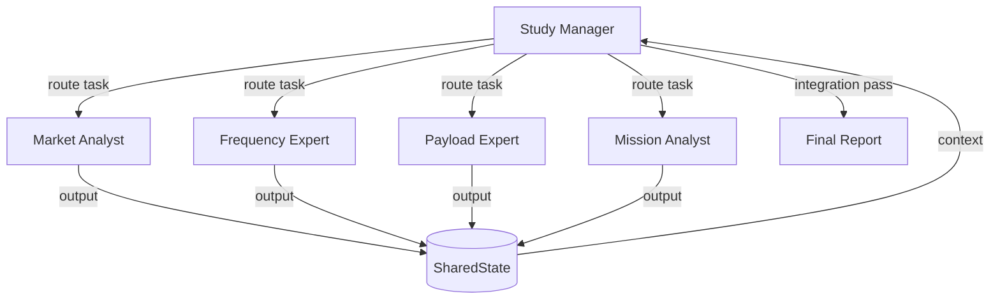

# System 2: Centralized Manager

A hierarchical system where a Study Manager agent routes tasks to domain specialists.

## How It Works



### Loop (per round)

1. The **Manager** receives the current artifacts and decides which specialist should work next
2. The Manager outputs a JSON routing decision: `{next_agent, task, reasoning}`
3. The selected **Specialist** receives the task plus context from previous artifacts
4. The specialist's output is published to `SharedState`
5. The Manager re-evaluates → repeat or signal `DONE`
6. After all specialist work, the Manager performs an **integration pass**

### Routing Decision Format

```json
{
  "next_agent": "Payload Expert",
  "task": "Generate link budgets for 400, 735, and 1100 km",
  "context": "Market analyst estimated 50 Gbps throughput...",
  "reasoning": "Frequency selection is complete, payload design is next"
}
```

When done: `{"next_agent": "DONE", "task": "integration"}`

## Agents

| Agent | Role |
|-------|------|
| **Study Manager** | Coordinates specialists, checks consistency, integrates |
| **Market Analyst** | Demand estimation, underserved regions, throughput |
| **Frequency Filing Expert** | ITU bands, G/T, EIRP, spectrum compliance |
| **Payload Expert** | Link budgets, antenna sizing, RF design |
| **Mission Analyst** | Constellation sizing, orbit selection, cost analysis |

Agent identities are defined in `src/domain/roles.py`, adapted from the original CrewAI prompts.

## Context Injection

Before each specialist runs, the system injects a summary of all existing artifacts into the conversation. This ensures specialists build on each other's work.

## Implementation

:material-file-code: `src/systems/centralized/system.py`
:material-file-code: `src/systems/centralized/manager.py`
:material-file-code: `src/systems/centralized/routing.py`

## Configuration

```yaml
max_rounds: 10     # Maximum routing rounds before forced integration
```

The system will run up to `max_rounds` specialist calls, then always performs a final integration pass.
