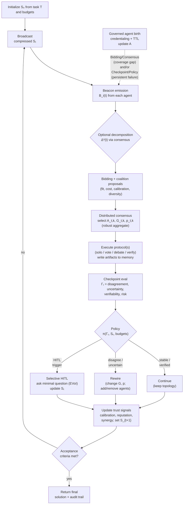

# System 3: DiCWO

**Distributed Calibration-Weighted Orchestration** — the proposed system. Agents self-organize through a closed-loop orchestration mechanism combining calibration-aware selection, adaptive topologies and protocols, checkpoint-driven reconfiguration, and governed agent synthesis (Figure 1).

## Architecture (Figure 1)



## Main Loop (Pseudocode)

```
Initialize S_0 from task T and budgets

for t = 0..T_max:
    broadcast compressed(S_t) to agent pool
    for each agent: B_i(t) = emit_beacon(S_t, P_i)
    Δ*(t) = optional consensus_decompose(S_t)
    for each subtask T_k in Δ*(t):
        bids = compute_bids(T_k)             # fit, cost, calibration, diversity
        coalitions = propose_coalitions(T_k)  # micro-coalitions with synergy
        (A, G, p) = consensus_select(bids, coalitions)  # team, topology, protocol
        outputs_k = execute(A, G, p, S_t)
        write_artifacts(outputs_k)
    Γ_t = checkpoint(S_t, new_artifacts)      # disagreement, uncertainty, verifiability, risk
    action = π(Γ_t, S_t, budgets)             # Continue / Rewire / HITL
    if action == HITL: selective_question(EVoI), update S_t
    if action == Rewire: change G, p; add/remove agents
    governed_agent_birth(coverage_gaps, persistent_failures)
    update_calibration_reputation_synergy()
    S_{t+1} = updated state
    if acceptance_criteria_met(S_t): return solution + audit trail
```

The loop processes **all pending subtasks per iteration** (not one at a time), then makes a single aggregate policy decision.

!!! note "HITL in current implementation"
    Selective HITL escalation is part of the DiCWO architecture (Figure 1) but is **disabled** in the current implementation. The policy returns Continue, Rewire, or Stop (early acceptance). HITL support can be re-enabled when a human-in-the-loop interface is available.

## The Phases

### 0. Consensus-Based Task Decomposition

Before the main loop (and optionally re-triggered every 3 rounds or after a rewire), agents propose subtask orderings via `ConsensusMerge({Decompose()})`. Each agent suggests an ordering based on their expertise; orderings are merged via **Borda count** (ranked voting).

:material-file-code: `src/systems/dicwo/consensus.py` — `decompose_and_merge()`

### 1. Beacons

Each agent broadcasts an enhanced beacon containing:

| Field | Description |
|-------|-------------|
| `capabilities` | What the agent can do |
| `needs` | What the agent needs from others |
| `estimated_cost` | Cost estimate for claimed tasks |
| `calibrated_confidence` | Confidence adjusted by calibration history |
| `suggested_collaborators` | Preferred partners |
| `evidence` | References to past successful outputs |
| `evidence_weight` | Anti-gaming: reduced if claims are unsupported |

**Anti-gaming**: Beacons with no evidence get their `evidence_weight` progressively down-weighted.

**Context compression**: Before broadcasting, shared state is compressed (truncated to 3000 chars) to bound context growth across iterations.

:material-file-code: `src/systems/dicwo/beacon.py`

### 2. Bidding + Coalition Proposals

The paper's 4-term bidding formula:

$$
\text{bid}_{i,k}(t) = \alpha \cdot \text{fit}(P_i, T_k) - \beta \cdot \text{cal\_penalty}(P_i) - \gamma \cdot \text{cost}(P_i, T_k) + \delta \cdot \text{divgain}(P_i)
$$

| Term | Description | Default Weight |
|------|-------------|----------------|
| `fit` | Capability match (1.0 = primary, 0.5+ = related, 0.1 = unrelated) | alpha = 1.0 |
| `cal_penalty` | 1 - calibration_score (penalizes poorly calibrated agents) | beta = 0.5 |
| `cost` | Estimated cost adjusted by load | gamma = 0.3 |
| `divgain` | Bonus for less-frequently-assigned agents | delta = 0.2 |

Plus a small **reputation** bonus tracked via exponential moving average.

**Coalition Proposals**: After computing bids, the bidding engine generates candidate micro-coalitions from the top 3-4 bidders:

| Coalition Type | When | Description |
|---------------|------|-------------|
| **Solo** | Always | Top-1 bidder alone |
| **Proposer-Critic** | Large score gap (> 0.3) | Stronger agent leads, weaker verifies |
| **Solver-Verifier** | Medium gap (> 0.1) | Complementary roles |
| **Parallel-Independent** | Similar scores | Both agents execute independently |

Coalitions are scored by `combined_fit + 0.2 * synergy_score`.

:material-file-code: `src/systems/dicwo/bidding.py`

### 3. Joint ConsensusSelect

Agents vote on **three decisions simultaneously** via `joint_consensus_select()`:

1. **Team (A)** — which coalition should execute
2. **Topology (G)** — communication structure (`full`, `star`, `ring`)
3. **Protocol (p)** — execution strategy (`solo`, `audit`, `debate`, `parallel`, `tool_verified`)

Three voters cast votes on the triple; votes are tallied **per dimension** weighted by confidence.

| Protocol | Description |
|----------|-------------|
| **Solo** | Single agent executes alone |
| **Audit** | Primary executes, coalition partner reviews |
| **Debate** | Two agents produce competing outputs |
| **Parallel** | Multiple agents execute independently, best merged |
| **Tool-verified** | Agent executes, then a second pass verifies the result |

:material-file-code: `src/systems/dicwo/consensus.py` — `joint_consensus_select()`

### 4. Execution

The selected protocol runs according to the chosen strategy (solo, audit, debate, parallel, or tool-verified).

### 5. Checkpoint

After execution, outputs from **all subtasks in the iteration** are evaluated for four signals:

| Signal | Measures | Range |
|--------|----------|-------|
| **Disagreement** | How much agents disagree (when multiple outputs) | 0-1 |
| **Uncertainty** | Self-assessed confidence in claims | 0-1 |
| **Verifiability** | Fraction of claims that can be checked | 0-1 |
| **Risk** | Weighted combination: `0.4*disagree + 0.3*uncert + 0.3*(1-verif)` | 0-1 |

Signals are aggregated across subtasks using **worst-case**: highest disagreement, highest uncertainty, lowest verifiability, highest risk.

:material-file-code: `src/systems/dicwo/checkpoint.py`

### 6. Policy π(Γₜ, Sₜ, budgets)

The policy maps checkpoint signals to one of **three control actions** (Figure 1):

| Decision | Trigger | Action |
|----------|---------|--------|
| **Continue** | Stable, verified — low disagreement + sufficient evidence | Keep current topology and protocol, advance to next iteration |
| **Rewire** | Disagree / uncertain — additional deliberation or diversity needed | Change topology G and/or protocol p; may add/remove agents |
| **HITL** | High uncertainty + low verifiability + high risk | Select minimal question via EVoI, present to human, incorporate response |

Agent spawning is handled separately via governed agent birth (see below).

**Acceptance Criteria**: After trust updates, `acceptance_met()` checks if all tracked subtasks are above the quality threshold (default 0.7). This is a **separate decision point** from the policy (see Figure 1 diamond), enabling early loop termination.

!!! note "Current implementation"
    HITL is disabled — the policy returns Continue, Rewire, or Stop (when acceptance criteria are met). The HITL path will be activated when a human interface is connected.

:material-file-code: `src/systems/dicwo/policy.py`

### 7. Governed Agent Birth (Dual Trigger)

Agent birth is decoupled from the policy and triggered by two conditions (Figure 1, top-right):

1. **Bidding / Consensus — coverage gap**: no agent (or coalition) achieves minimum suitability for a necessary subtask
2. **Checkpoint / Policy — persistent failure**: verification repeatedly flags missing expertise (>= 2 consecutive failures)

When triggered, a role synthesis mechanism proposes a new agent specification, which is then credentialed via a lightweight entrance micro-task. Newly created agents are governed by explicit budget constraints and **TTL retirement rules** to prevent uncontrolled expansion. Upon acceptance, the agent pool **A** is updated and subsequent iterations re-run beacon emission and consensus selection.

:material-file-code: `src/systems/dicwo/agent_factory.py`

### 8. Update Calibration, Reputation & Synergy

After each iteration, three quantities are updated for all agents involved:

- **Calibration**: Exponential decay on failure, recovery on success
- **Reputation**: Running average of output quality per agent
- **Synergy**: Tracks how well pairs of agents work together (coalition quality)

## Supporting Components

### Topology

A directed communication graph between agents. Supports three layouts:

- **Full** — everyone can talk to everyone (default)
- **Star** — all communication goes through a center node
- **Ring** — each agent connects to the next in sequence

The policy engine can **rewire** the topology when disagreement or uncertainty is high.

:material-file-code: `src/systems/dicwo/topology.py`

### Agent Factory (Governed Agent Birth)

When a **coverage gap** (bidding/consensus) or **persistent failure** (checkpoint) is detected, the factory synthesizes a new specialist with **credentialing**:

1. Role synthesis — uses the LLM to generate a role description (scope, tools, rubric)
2. Entrance micro-task — runs a domain-specific credentialing question
3. Peer evaluation — evaluates the answer for technical accuracy
4. Consensus acceptance — admits only if score >= threshold (default 0.5)
5. **TTL + budget governance** — the agent is garbage-collected after N rounds; total spawned agents are capped

:material-file-code: `src/systems/dicwo/agent_factory.py`

## Metadata Output

Each DiCWO run produces metadata including:

| Field | Description |
|-------|-------------|
| `rounds_used` | Number of iterations executed |
| `completed_subtasks` | List of completed subtask names |
| `early_stop` | Whether acceptance criteria triggered early exit |
| `spawned_agents` | Dynamically created agents with credentialing info |
| `topology` | Final communication graph structure |
| `reputation` | Per-agent reputation scores |
| `synergy` | Pair-wise agent synergy scores |
| `subtask_quality` | Quality score for each completed subtask |
| `coverage_gaps` | Subtasks that had no capable bidders |
| `failure_tracker` | Consecutive failure count per subtask |

## Configuration

See the [DiCWO parameters](../getting-started/configuration.md#dicwo-parameters) section for all tunable values.
