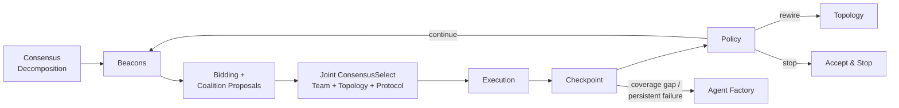

# System 3: DiCWO

**Distributed Calibration-Weighted Orchestration** — the proposed system. Agents self-organize through an iteration-level loop with coalition proposals, joint consensus, and a simplified adaptive policy (Figure 1).

## Architecture



## Main Loop (Figure 1)

```
Initialize shared state S_0 from T
subtasks = ConsensusMerge({Decompose(S_t, P_i)})

for t = 0..T_max:
    compressed = compress_state(S_t)
    broadcast beacons (compressed S_t)
    optional re-decomposition (every 3 rounds or after rewire)
    for each pending subtask T_k:
        bids = compute_bids(T_k)
        coalitions = propose_coalitions(T_k)
        (A, G, p) = joint_consensus_select(coalitions)
        outputs_k = execute(T_k, A[0], p, A)
    signals_map = checkpoint_iteration(outputs)
    decision = policy(aggregate(signals_map))
    handle_policy(decision)            # Continue / Rewire / Stop
    maybe_spawn_agents()               # dual trigger: coverage gap + persistent failure
    update_calibration_reputation_synergy()
    if acceptance_met(): break
```

The loop processes **all pending subtasks per iteration** (not one at a time), then makes a single aggregate policy decision.

## The Phases

### 0. Consensus-Based Task Decomposition

Before the main loop (and optionally re-triggered every 3 rounds or after a rewire), agents propose subtask orderings via `ConsensusMerge({Decompose()})`. Each agent suggests an ordering based on their expertise; orderings are merged via **Borda count** (ranked voting).

:material-file-code: `src/systems/dicwo/consensus.py` — `decompose_and_merge()`

### 1. Beacons

Each agent broadcasts an enhanced beacon containing:

| Field | Description |
|-------|-------------|
| `capabilities` | What the agent can do |
| `needs` | What the agent needs from others |
| `estimated_cost` | Cost estimate for claimed tasks |
| `calibrated_confidence` | Confidence adjusted by calibration history |
| `suggested_collaborators` | Preferred partners |
| `evidence` | References to past successful outputs |
| `evidence_weight` | Anti-gaming: reduced if claims are unsupported |

**Anti-gaming**: Beacons with no evidence get their `evidence_weight` progressively down-weighted.

**Context compression**: Before broadcasting, shared state is compressed (truncated to 3000 chars) to bound context growth across iterations.

:material-file-code: `src/systems/dicwo/beacon.py`

### 2. Bidding + Coalition Proposals

The paper's 4-term bidding formula:

$$
\text{bid}_{i,k}(t) = \alpha \cdot \text{fit}(P_i, T_k) - \beta \cdot \text{cal\_penalty}(P_i) - \gamma \cdot \text{cost}(P_i, T_k) + \delta \cdot \text{divgain}(P_i)
$$

| Term | Description | Default Weight |
|------|-------------|----------------|
| `fit` | Capability match (1.0 = primary, 0.5+ = related, 0.1 = unrelated) | alpha = 1.0 |
| `cal_penalty` | 1 - calibration_score (penalizes poorly calibrated agents) | beta = 0.5 |
| `cost` | Estimated cost adjusted by load | gamma = 0.3 |
| `divgain` | Bonus for less-frequently-assigned agents | delta = 0.2 |

Plus a small **reputation** bonus tracked via exponential moving average.

**Coalition Proposals**: After computing bids, the bidding engine generates candidate micro-coalitions from the top 3-4 bidders:

| Coalition Type | When | Description |
|---------------|------|-------------|
| **Solo** | Always | Top-1 bidder alone |
| **Proposer-Critic** | Large score gap (> 0.3) | Stronger agent leads, weaker verifies |
| **Solver-Verifier** | Medium gap (> 0.1) | Complementary roles |
| **Parallel-Independent** | Similar scores | Both agents execute independently |

Coalitions are scored by `combined_fit + 0.2 * synergy_score`.

:material-file-code: `src/systems/dicwo/bidding.py`

### 3. Joint ConsensusSelect

Agents vote on **three decisions simultaneously** via `joint_consensus_select()`:

1. **Team (A)** — which coalition should execute
2. **Topology (G)** — communication structure (`full`, `star`, `ring`)
3. **Protocol (p)** — execution strategy (`solo`, `audit`, `debate`, `parallel`, `tool_verified`)

Three voters cast votes on the triple; votes are tallied **per dimension** weighted by confidence.

| Protocol | Description |
|----------|-------------|
| **Solo** | Single agent executes alone |
| **Audit** | Primary executes, coalition partner reviews |
| **Debate** | Two agents produce competing outputs |
| **Parallel** | Multiple agents execute independently, best merged |
| **Tool-verified** | Agent executes, then a second pass verifies the result |

:material-file-code: `src/systems/dicwo/consensus.py` — `joint_consensus_select()`

### 4. Execution

The selected protocol runs according to the chosen strategy (solo, audit, debate, parallel, or tool-verified).

### 5. Checkpoint

After execution, outputs from **all subtasks in the iteration** are evaluated for four signals:

| Signal | Measures | Range |
|--------|----------|-------|
| **Disagreement** | How much agents disagree (when multiple outputs) | 0-1 |
| **Uncertainty** | Self-assessed confidence in claims | 0-1 |
| **Verifiability** | Fraction of claims that can be checked | 0-1 |
| **Risk** | Weighted combination: `0.4*disagree + 0.3*uncert + 0.3*(1-verif)` | 0-1 |

Signals are aggregated across subtasks using **worst-case**: highest disagreement, highest uncertainty, lowest verifiability, highest risk.

:material-file-code: `src/systems/dicwo/checkpoint.py`

### 6. Policy (3 actions)

Based on the aggregated checkpoint signals, the policy engine decides:

| Decision | Trigger | Action |
|----------|---------|--------|
| **Stop** | All subtasks above quality threshold | Accept results and exit early |
| **Rewire** | High disagreement or uncertainty | Change communication topology |
| **Continue** | Signals within bounds | Proceed to next iteration |

Agent spawning is handled separately (see below), not by the policy engine.

**Acceptance Criteria**: `acceptance_met()` checks if all tracked subtasks are above the quality threshold (default 0.7), enabling early loop termination.

:material-file-code: `src/systems/dicwo/policy.py`

### 7. Agent Spawning (Dual Trigger)

Agent spawning is decoupled from the policy and triggered by two conditions:

1. **Coverage gap** — a subtask had no capable bidders during the bidding phase
2. **Persistent failure** — a subtask failed checkpoint >= 2 consecutive times

Spawned agents go through credentialing (entrance micro-task) and have a TTL.

:material-file-code: `src/systems/dicwo/agent_factory.py`

### 8. Update Calibration, Reputation & Synergy

After each iteration, three quantities are updated for all agents involved:

- **Calibration**: Exponential decay on failure, recovery on success
- **Reputation**: Running average of output quality per agent
- **Synergy**: Tracks how well pairs of agents work together (coalition quality)

## Supporting Components

### Topology

A directed communication graph between agents. Supports three layouts:

- **Full** — everyone can talk to everyone (default)
- **Star** — all communication goes through a center node
- **Ring** — each agent connects to the next in sequence

The policy engine can **rewire** the topology when disagreement or uncertainty is high.

:material-file-code: `src/systems/dicwo/topology.py`

### Agent Factory

When a **coverage gap** or **persistent failure** is detected, the factory synthesizes a new specialist with **credentialing**:

1. Uses the LLM to generate a role description
2. Runs an **entrance micro-task** (domain-specific question)
3. Evaluates the answer for technical accuracy
4. Admits only if score >= threshold (default 0.5)
5. Assigns a **TTL** — the agent is garbage-collected after N rounds

:material-file-code: `src/systems/dicwo/agent_factory.py`

## Metadata Output

Each DiCWO run produces metadata including:

| Field | Description |
|-------|-------------|
| `rounds_used` | Number of iterations executed |
| `completed_subtasks` | List of completed subtask names |
| `early_stop` | Whether acceptance criteria triggered early exit |
| `spawned_agents` | Dynamically created agents with credentialing info |
| `topology` | Final communication graph structure |
| `reputation` | Per-agent reputation scores |
| `synergy` | Pair-wise agent synergy scores |
| `subtask_quality` | Quality score for each completed subtask |
| `coverage_gaps` | Subtasks that had no capable bidders |
| `failure_tracker` | Consecutive failure count per subtask |

## Configuration

See the [DiCWO parameters](../getting-started/configuration.md#dicwo-parameters) section for all tunable values.
