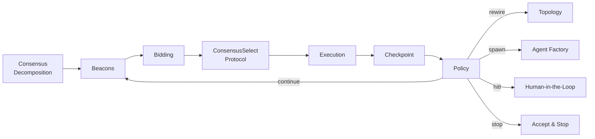

# System 3: DiCWO

**Distributed Calibration-Weighted Orchestration** — the proposed system. Agents self-organize through a multi-phase loop with adaptive policies, matching the paper's pseudocode (Section 5.9).

## Architecture



## Main Loop (Paper Pseudocode)

```
Initialize shared state S_0 from T
subtasks = ConsensusMerge({Decompose(S_t, P_i)})

for t = 0..T_max:
    broadcast S_t
    for each agent: EmitBeacon(S_t, P_i)
    for each subtask T_k:
        bids = {bid_{i,k}(t)}
        (team, topology, protocol) = ConsensusSelect(bids)
        outputs_k = ExecuteProtocol(team, topology, protocol, S_t)
    Gamma_t = CheckpointSignals(S_t, outputs)
    action = Policy(Gamma_t, budgets)
    UpdateCalibrationReputationSynergy()
    if AcceptanceCriteriaMet(S_t): break
```

## The Phases

### 0. Consensus-Based Task Decomposition

Before the main loop, agents propose subtask orderings via `ConsensusMerge({Decompose()})`. Each agent suggests an ordering based on their expertise; orderings are merged via **Borda count** (ranked voting).

:material-file-code: `src/systems/dicwo/consensus.py` — `decompose_and_merge()`

### 1. Beacons

Each agent broadcasts an enhanced beacon containing:

| Field | Description |
|-------|-------------|
| `capabilities` | What the agent can do |
| `needs` | What the agent needs from others |
| `estimated_cost` | Cost estimate for claimed tasks |
| `calibrated_confidence` | Confidence adjusted by calibration history |
| `suggested_collaborators` | Preferred partners |
| `evidence` | References to past successful outputs |
| `evidence_weight` | Anti-gaming: reduced if claims are unsupported |

**Anti-gaming**: Beacons with no evidence get their `evidence_weight` progressively down-weighted.

:material-file-code: `src/systems/dicwo/beacon.py`

### 2. Bidding

The paper's 4-term bidding formula:

$$
\text{bid}_{i,k}(t) = \alpha \cdot \text{fit}(P_i, T_k) - \beta \cdot \text{cal\_penalty}(P_i) - \gamma \cdot \text{cost}(P_i, T_k) + \delta \cdot \text{divgain}(P_i)
$$

| Term | Description | Default Weight |
|------|-------------|----------------|
| `fit` | Capability match (1.0 = primary, 0.5+ = related, 0.1 = unrelated) | alpha = 1.0 |
| `cal_penalty` | 1 - calibration_score (penalizes poorly calibrated agents) | beta = 0.5 |
| `cost` | Estimated cost adjusted by load | gamma = 0.3 |
| `divgain` | Bonus for less-frequently-assigned agents | delta = 0.2 |

Plus a small **reputation** bonus tracked via exponential moving average.

**Coalitions**: The top-k bidders form a coalition (used for audit/debate protocols).

:material-file-code: `src/systems/dicwo/bidding.py`

### 3. ConsensusSelect

Agents vote on the execution protocol via distributed consensus. Available protocols:

| Protocol | Description |
|----------|-------------|
| **Solo** | Single agent executes alone |
| **Audit** | Primary executes, coalition partner reviews |
| **Debate** | Two agents produce competing outputs |
| **Parallel** | Multiple agents execute independently, best merged |
| **Tool-verified** | Agent executes, then a second pass verifies the result |

Votes are weighted by confidence. The consensus considers subtask criticality and previous disagreement levels.

:material-file-code: `src/systems/dicwo/consensus.py` — `consensus_select_protocol()`

### 4. Execution

The selected protocol runs according to the chosen strategy (solo, audit, debate, parallel, or tool-verified).

### 5. Checkpoint

After execution, outputs are evaluated for four signals:

| Signal | Measures | Range |
|--------|----------|-------|
| **Disagreement** | How much agents disagree (when multiple outputs) | 0-1 |
| **Uncertainty** | Self-assessed confidence in claims | 0-1 |
| **Verifiability** | Fraction of claims that can be checked | 0-1 |
| **Risk** | Weighted combination: `0.4*disagree + 0.3*uncert + 0.3*(1-verif)` | 0-1 |

:material-file-code: `src/systems/dicwo/checkpoint.py`

### 6. Policy

Based on checkpoint signals, the policy engine decides (in priority order):

| Decision | Trigger | Action |
|----------|---------|--------|
| **Stop** | All subtasks above quality threshold | Accept results and exit early |
| **HITL** | High risk + high EVoI + budget remaining | Flag for human review |
| **Verify** | Low verifiability + uncertainty | Request additional verification |
| **Spawn** | Capability gap detected | Create new credentialed specialist |
| **Rewire** | High disagreement | Change communication topology |
| **Escalate** | High uncertainty | Request additional review |
| **Continue** | Signals within bounds | Proceed to next subtask |

**HITL Budget**: Limited to N calls per session (default 3).

**Acceptance Criteria**: `AcceptanceCriteriaMet()` checks if all tracked subtasks are above the quality threshold, enabling early loop termination.

**Subtask Revisiting**: If checkpoint signals are too poor, the subtask is retried (up to `max_subtask_retries`) before moving on.

:material-file-code: `src/systems/dicwo/policy.py`

### 7. Update Calibration, Reputation & Synergy

After each subtask, three quantities are updated:

- **Calibration**: Exponential decay on failure, recovery on success
- **Reputation**: Running average of output quality per agent
- **Synergy**: Tracks how well pairs of agents work together (coalition quality)

## Supporting Components

### Topology

A directed communication graph between agents. Supports three layouts:

- **Full** — everyone can talk to everyone (default)
- **Star** — all communication goes through a center node
- **Ring** — each agent connects to the next in sequence

The policy engine can **rewire** the topology when disagreement is high.

:material-file-code: `src/systems/dicwo/topology.py`

### Agent Factory

When the policy detects a **capability gap**, the factory synthesizes a new specialist with **credentialing**:

1. Uses the LLM to generate a role description
2. Runs an **entrance micro-task** (domain-specific question)
3. Evaluates the answer for technical accuracy
4. Admits only if score >= threshold (default 0.5)
5. Assigns a **TTL** — the agent is garbage-collected after N rounds

:material-file-code: `src/systems/dicwo/agent_factory.py`

### Human-in-the-Loop

Computes the **Expected Value of Information** (EVoI) to decide when human input is worth requesting:

$$
\text{EVoI} = \text{uncertainty} \times \text{risk} \times (1 + \text{disagreement})
$$

Constrained by a **session budget** (max N HITL calls). In automated experiment mode, HITL questions are logged but auto-responded.

:material-file-code: `src/systems/dicwo/hitl.py`

## Configuration

See the [DiCWO parameters](../getting-started/configuration.md#dicwo-parameters) section for all tunable values.
