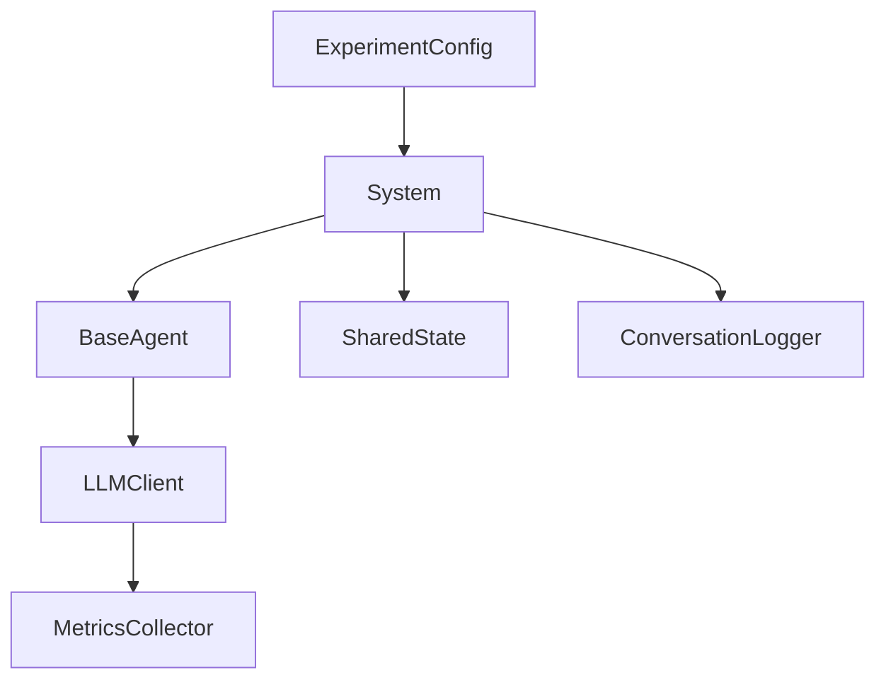

# Systems Overview

The framework implements three multi-agent architectures of increasing complexity. All three solve the same satellite mission design problem and produce the same deliverables, enabling direct comparison.

## Comparison

| | Single Agent | Centralized | DiCWO |
|--|-------------|-------------|-------|
| **Architecture** | Monolithic | Hierarchical | Distributed |
| **Agents** | 1 (all roles) | 5 (manager + 4 specialists) | 5+ (dynamic) |
| **LLM calls** | 1 | ~8-12 | ~15-30 |
| **Orchestration** | None | Manager decides | Self-organizing |
| **Iteration** | None | Manager re-routes | Checkpoint → policy loop |
| **Quality control** | None | Manager review | Consensus + audit + checkpoint |

## Shared Foundation

All systems build on the same core layer:



- **BaseAgent** — Identity + LLM + conversation history. No orchestration logic.
- **SharedState** — Key-value artifact store with event logging.
- **LLMClient** — OpenAI-compatible wrapper with automatic cost/token tracking.

## Data Flow

All three systems produce a `SystemResult`:

```python
@dataclass
class SystemResult:
    artifacts: dict[str, Any]         # Named outputs per subtask
    conversation_log: list[dict]      # Full message trace
    metadata: dict[str, Any]          # System-specific info
```

The `ExperimentRunner` then saves everything, runs evaluation, and generates reports.
